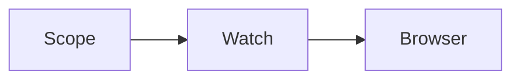

# Post-fix demo

**Pass:** Mermaid fence-safe + live reload

## Diagram (simple flowchart)

### Content after the diagram

You should see this section **below** the diagram even with **Changes** on.

| Item | Value |
|------|--------|
| Edit | primary write |
| Tool calls | scope only (already scoped) |

---

## Second edit (no tool call)

If this appears live, the watcher + Mermaid fix are both good.

- [x] Primary write
- [x] Follow-up without `scope_markdown`
