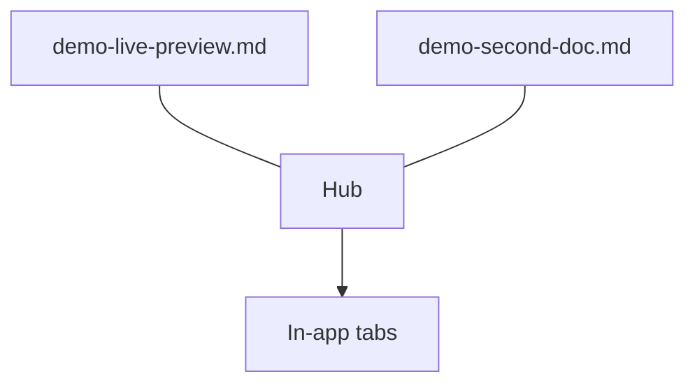

# Second document

This is a **new** file — should open as its own tab next to `demo-live-preview.md`.

## Why this matters

| Behavior | Expected |
|----------|----------|
| New tab | one per scoped path |
| Unread dot | on the other tab if it was inactive |
| First create | browser already open → no second window |

### Below the diagram

Still here after Mermaid. New file, new tab, same hub.

## Live follow-up

Second write on this path — no extra `scope_markdown`.
